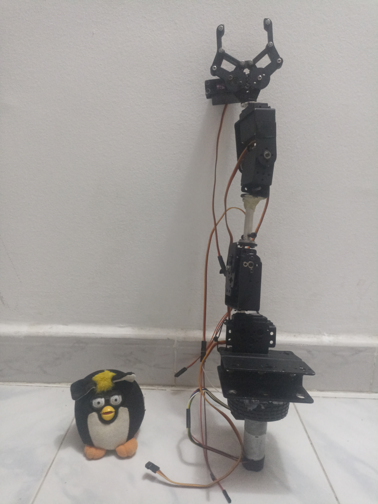
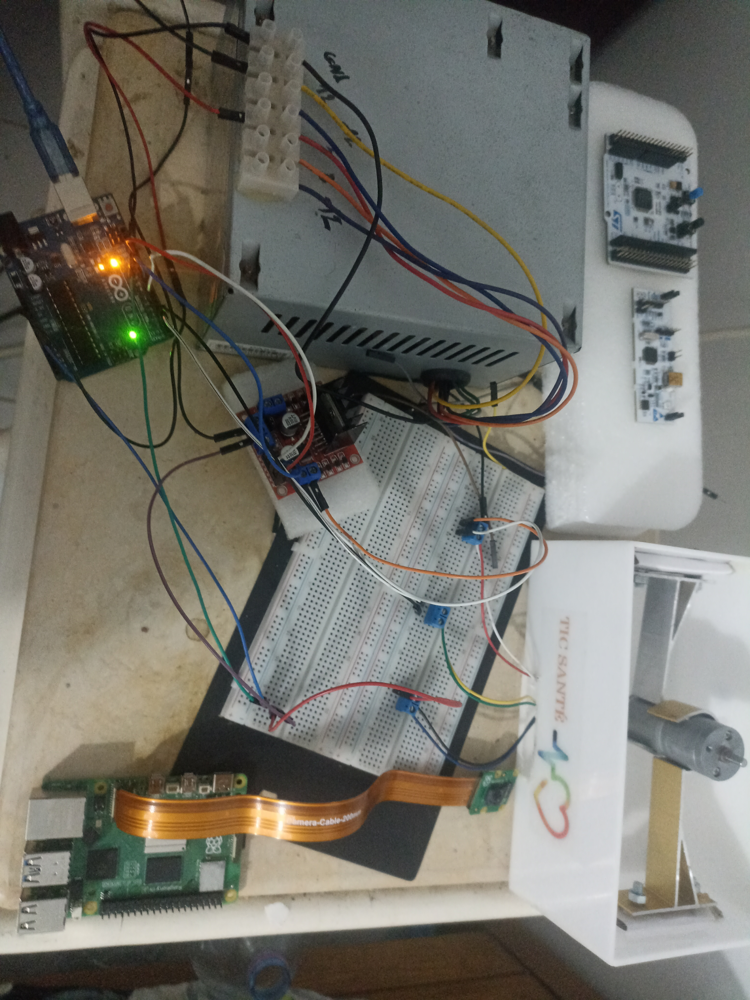

# Madara 6DoF Arm

> **Status: 🚧 In Progress**

A 6-degree-of-freedom robotic arm built with ROS 2 Humble, MoveIt2, and Ignition Gazebo Fortress.
Designed to run on a Raspberry Pi 5 inside Docker with full simulation and real hardware support.

---

## Hardware

| Component | Part |
|---|---|
| SBC | Raspberry Pi 5 |
| Microcontroller | Arduino Uno |
| DC Motor (base rotation) | JGA25-371 12V 18RPM + quadrature encoder |
| Servo motors (×5) | MG966R |
| Motor driver | L298N H-Bridge |
| Camera | Raspberry Pi Camera Module v2 (IMX219) |

---

## Photos

<!-- Place your images in docs/images/ and update the filenames below -->

<p align="center">
  
</p>
<p align="center"><em>Physical build</em></p>

<p align="center">
  
</p>
<p align="center"><em>Simulation in RViz2 + Ignition Gazebo</em></p>

---

## Quick Start

```bash
git clone https://github.com/yassine-cherni/madara_6DoF_arm.git
cd madara_6DoF_arm
docker compose build
xhost +local:docker
docker compose up -d madara
docker exec -it madara bash
```

Inside the container:
```bash
cd /madara_ws
colcon build --symlink-install
source install/setup.bash

# Simulation
ros2 launch madara_bringup gz_launch.py

# Mock demo (no hardware needed)
ros2 launch madara_moveit_config demo.launch.py
```

Full setup instructions: [`docs/setup.md`](docs/setup.md)

---

## Stack

| Layer | Technology |
|---|---|
| OS | Ubuntu 22.04 (Docker) on Raspberry Pi OS (Bookworm) |
| Middleware | ROS 2 Humble |
| Motion planning | MoveIt2 |
| Simulation | Ignition Gazebo Fortress |
| Hardware interface | ros2_control + custom UART plugin |
| Camera driver | camera_ros (libcamera) |
| Containerization | Docker + Docker Compose |

---

## TODO

- [x] URDF + MoveIt2 configuration
- [x] Gazebo Fortress simulation with simulated camera
- [x] ros2_control hardware interface (UART → Arduino)
- [x] Arduino firmware (PID position control + servo control)
- [x] RPi Camera v2 integration via libcamera
- [ ] **Policy training deployment with ros2_control** *(In Progress)*
- [ ] **Zenoh-pico with RTEMS on RP2350 (Raspberry Pi Pico 2)**
- [ ] Future: Pixi environment with ROS 2 Jazzy / Kilted / Lyrical

---

## Project Structure